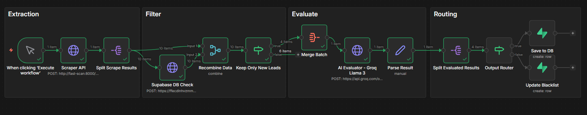

# AI-Powered Lead Generation Pipeline

A highly optimized, self-learning Extract-Transform-Load (ETL) data pipeline built to automate local business prospecting. This system scrapes raw data, filters it against a relational database, evaluates it using a batched LLM approach, and routes the validated data into a storage layer.

## Tech Stack

- **Orchestration:** n8n
- **Web Scraping:** Python, FastAPI, Playwright (Headless Chromium)
- **AI / LLM:** Groq API (Llama-3.1-8b-instant)
- **Database:** Supabase (PostgreSQL)
- **Infrastructure:** Docker & Docker Compose

## Pipeline Architecture (n8n)

The pipeline is split into four highly optimized micro-processes to ensure minimal API costs and maximum execution speed:

### 1. Extraction

- **Manual Trigger:** Initiates the workflow.
- **Scraper API:** Makes a `POST` request to a custom containerized FastAPI microservice. The service uses Playwright to seamlessly scrape Google Maps for targeted local businesses.
- **Split Scrape Results:** Deconstructs the JSON array into individual processing items.

### 2. The Database Shield (Filter)

- **Supabase DB Check:** Executes a custom PostgreSQL RPC (`check_lead`) to verify if the business `place_id` already exists, or if the name matches a known corporate chain in the `blacklist` table.
- **Recombine Data:** Merges the original scrape data with the database response using a Zip/Position strategy.
- **Keep Only New Leads:** Visually branches the data, immediately dropping duplicates to save compute time and AI tokens.

### 3. AI Batch Evaluator

- **Merge Batch:** Aggregates only the surviving un-processed leads back into a single JSON array (The "Filter Funnel" pattern).
- **AI Evaluator (Groq Llama-3.1):** Passes the batched array to the LLM in a single API call. Uses system prompt constraints and JSON-mode to strictly format the output, appending an `ai_status` ("Valid" or "Corporate") to every lead.
- **Parse Result:** Dynamically parses the strictly-typed JSON response back into structural n8n arrays.

### 4. Routing & Persistence

- **Split Evaluated Results:** Breaks the batched AI answer back into single data entities.
- **Output Router:** Evaluates the `ai_status` injected by the LLM.
- **Save to DB (True):** Inserts fully verified, local small businesses into the `leads` table for the next phase of deep web auditing.
- **Update Blacklist (False):** Inserts massive corporate chains and franchises into the `blacklist` table. This creates a **self-learning pipeline**, ensuring the Database Shield (Phase 2) will automatically block this corporate entity entirely on all future execution runs.

## Running the Project

1. Clone the repository.
2. Ensure Docker Desktop is running and execute `docker compose up -d --build`.
3. Import the `n8n-workflow.json` into your local n8n instance.
4. Add your Groq and Supabase API keys to your n8n credentials.
5. Click **Execute Workflow**.
