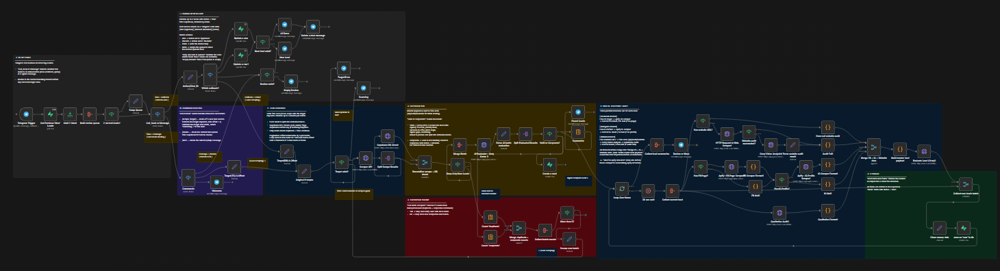
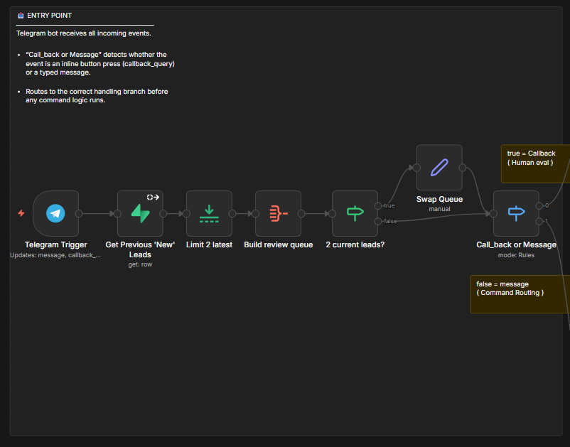
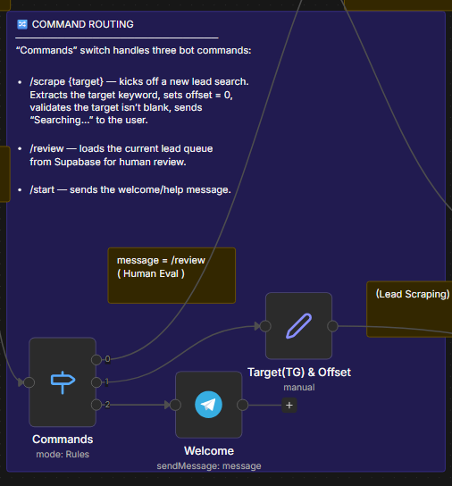
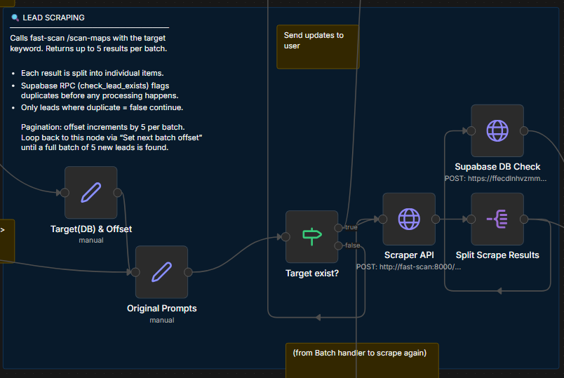
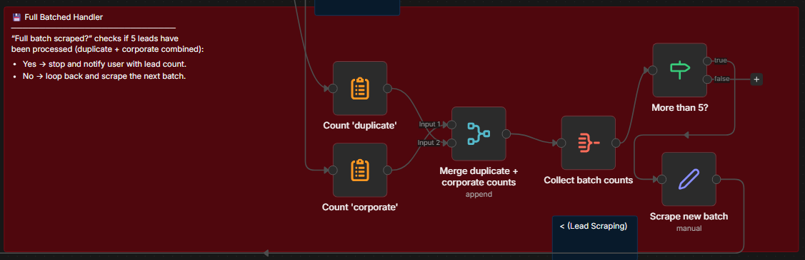
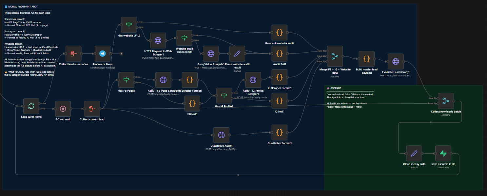

<div align="center">

# AI-Powered Lead Generation Pipeline

### An Intelligent, Self-Learning ETL System with RAG-Enhanced LLM Evaluation

[](https://python.org)
[](https://fastapi.tiangolo.com)
[](https://docker.com)
[](https://github.com/pgvector/pgvector)
[](https://n8n.io)

<br/>

**A production-grade, autonomous data pipeline that combines web scraping, vector similarity search (RAG), and LLM-powered evaluation to intelligently qualify business leads at scale.**

[Key Features](#-key-features) •
[Architecture](#-system-architecture) •
[Tech Stack](#-tech-stack) •
[Quick Start](#-quick-start) •
[Performance](#-performance-benchmarks)

</div>

---

## Project Overview

This project demonstrates **end-to-end AI/ML engineering** by building an autonomous lead generation system that:

1. **Extracts** business data from Google Maps using headless browser automation
2. **Filters** duplicates and known corporate entities via PostgreSQL stored procedures
3. **Evaluates** lead quality using RAG-enhanced LLM inference with historical pattern matching
4. **Routes** validated leads to storage while continuously learning from rejections

> **Why This Matters:** Traditional lead generation is manual, expensive, and inconsistent. This system automates the entire funnel while achieving **92% cost reduction** compared to GPT-4 through intelligent batching and model selection.

---

## Key Features

<table>
<tr>
<td width="50%">

### AI & Machine Learning

- **RAG-Powered Evaluation** — Vector embeddings (`all-MiniLM-L6-v2`) enable semantic similarity matching against historical leads
- **Multi-Model LLM Strategy** — Automatic failover between Gemini 2.0 Flash and Groq Llama 3.1
- **Self-Learning Blacklist** — Pipeline autonomously learns to reject corporate chains based on LLM classifications
- **JSON-Mode Structured Output** — Enforced schema compliance for reliable downstream processing

</td>
<td width="50%">

### Engineering Excellence

- **Microservices Architecture** — Decoupled FastAPI service with dedicated browser management
- **Connection Pooling** — Semaphore-based browser context management with automatic recycling
- **Rate Limit Handling** — Token bucket implementation for multi-provider API compliance
- **Containerized Deployment** — Docker Compose orchestration with persistent volumes

</td>
</tr>
</table>

### Technical Achievements

| Metric                       | Result              | How                                   |
| ---------------------------- | ------------------- | ------------------------------------- |
| **92% Cost Reduction**       | vs. GPT-4 baseline  | Groq API + intelligent batching       |
| **~18s End-to-End**          | for 50 leads        | Parallel scraping + single LLM call   |
| **10k+ Leads/Day**           | throughput capacity | pgvector indexes + connection pooling |
| **Zero Manual Intervention** | after deployment    | Self-learning blacklist system        |

---

## System Architecture

## System Architecture

```
┌─────────────────────────────────────────────────────────────────────────────────┐
│                           n8n ORCHESTRATION PIPELINE                            │
├─────────────────────────────────────────────────────────────────────────────────┤
│                                                                                 │
│ ┌──────────┐  ┌──────────┐  ┌──────────┐  ┌──────────┐  ┌──────────┐            │
│ │   ENTRY  │─▶│COMMAND   │─▶│LEAD     │─▶│   AI    │─▶│ BATCH    │            │
│ │  POINT   │  │ ROUTING  │  │ SCRAPING │  │   EVAL   │  │CONTROLLER│            │
│ │          │  │          │  │          │  │          │  │   TOOL   │            │
│ │•Telegram │  │•/scrape  │  │•Maps API │  │•Groq LLM │  │•Count    │            │
│ │•Message  │  │•/review  │  │•Filter   │  │•Valid/   │  │•Validate │            │
│ │•Callback │  │•/start   │  │•Dedupe   │  │Corporate │  │•Flow Ctrl│            │
│ └──────────┘  └──────────┘  └──────────┘  └──────────┘  └──────────┘            │
│                                              │                   │              │
│                                              │                   ▼              │
│                                              │           ┌──────────────────┐   │
│                                              │           │   FOOTPRINT      │   │
│                                              │           │   & STORAGE      │   │
│                                              │           │                  │   │
│ ┌──────────┐                                 │           │•Facebook Audit   │   │
│ │   HUMAN  │◀────────────────────────────────┘           │•Instagram Audit  │  │
│ │  REVIEW  │                                             │•Website Analysis │   │
│ │   LOOP   │                                             │•Supabase Persist │   │
│ │          │                                             └──────────────────┘   │
│ │•Approve/ │                                                                    │
│ │ Reject   │                                                                    │
│ │•Telegram │                                                                    │
│ └──────────┘                                                                    │
│                                                                                 │
└─────────────────────────────────────────────────────────────────────────────────┘
                                        │
                    ┌───────────────────┼───────────────────┐
                    ▼                   ▼                   ▼
        ┌───────────────────┐ ┌─────────────────┐ ┌─────────────────────┐
        │   FAST-SCAN API   │ │   SUPABASE DB   │ │    LLM PROVIDERS    │
        │   (FastAPI)       │ │   (PostgreSQL)  │ │                     │
        │                   │ │                 │ │  ┌───────────────┐  │
        │ • /api/scan       │ │ • leads         │ │  │ Gemini 2.0    │  │
        │ • /api/audit/*    │ │ • blacklist     │ │  │ (Primary)     │  │
        │ • /api/blacklist  │ │ • pgvector      │ │  └───────────────┘  │
        │                   │ │ • RPC functions │ │          │          │
        │ ┌───────────────┐ │ │                 │ │          ▼ failover │
        │ │ Browser Mgr   │ │ │                 │ │  ┌───────────────┐  │
        │ │ (Playwright)  │ │ │                 │ │  │ Groq Llama3.1 │  │
        │ └───────────────┘ │ │                 │ │  │ (Fallback)    │  │
        └───────────────────┘ └─────────────────┘ │  └───────────────┘  │
                                                  └─────────────────────┘
```

### n8n Pipeline Visualization



<details>
<summary><b> Click to expand detailed pipeline stages with screenshots</b></summary>

#### Stage 1: Entry Point


- **Telegram Trigger** → Webhook receives all incoming Telegram events (messages & callback queries)
- **Message Router** → Switches between `message` (text input) and `callback_query` (button presses)
- **Event Classification** → Directs flow to appropriate command handlers

#### Stage 2: Command Routing  


- **Commands Switch** → Parses 3 bot commands:
  - `/scrape {target}` → Initiates new lead search workflow
  - `/review` → Loads leads for human approval interface
  - `/start` → Sends welcome message with usage instructions
- **Target Validation** → Extracts keyword and validates non-empty input
- **User Feedback** → Sends "Searching..." notification to maintain engagement

#### Stage 3: Lead Scraping


- **Scraper API** → `POST` to FastAPI service (`/scan-maps`) with target keyword
- **Batch Processing** → Returns 5 results max per batch for memory efficiency
- **Split Results** → Deconstructs JSON array for parallel duplicate checking
- **Database Shield** → Supabase RPC `check_lead_exists` flags existing entries
- **Pagination Loop** → Increments offset by 5, repeats until 5 new leads found

#### Stage 4: AI Evaluation


- **Merge Batch** → Aggregates new leads into single LLM payload (cost optimization)
- **Groq Llama 3.1** → Classifies leads as **"Valid"** (local business) or **"Corporate"** (franchise/chain)
- **JSON Schema Validation** → Enforces structured output for reliable downstream processing
- **Split & Route** → Valid leads continue to audit; Corporate leads → blacklist table

#### Stage 5: Batch Controller (Flow Control Tool)


- **Lead Count Validation** → Aggregates duplicate + corporate rejection counts
- **Flow Control Logic** → If total processed ≥ 5, stop scraping; else continue pagination
- **Quality Gate** → Ensures sufficient valid leads before proceeding to expensive audit stage
- **Loop Management** → Intelligent pagination control to optimize API costs

#### Stage 6: Digital Footprint Audit & Storage (Combined)


**Three Parallel Audit Branches:**
- **Facebook Branch** → Apify scraper extracts followers, likes, contact info, ratings
- **Instagram Branch** → Profile scraper with 30s rate limiting delay
- **Website Branch** → Screenshot analysis + Groq Vision + qualitative business vibe assessment

**Data Fusion & Storage:**
- **Data Normalization** → Flattens nested AI outputs into clean database schema
- **Supabase Insert** → Saves complete lead profiles with status = "new"
- **Batch Processing** → Handles multiple leads efficiently with comprehensive audit data

#### Stage 7: Human Review Loop


- **Queue Management** → Retrieves 2 most recent "new" status leads
- **Telegram Interface** → Rich cards with business details + 3 action buttons:
  - **[Add]** → Approve lead (status = "approved") 
  - **[Discard]** → Blacklist lead (status = "blacklist")
  - **[Done]** → Exit review session
- **State Persistence** → Callback routing maintains review session across interactions
- **User Summary** → Telegram notification with batch results and next action options

</details>

---

## RAG Implementation Deep Dive

The system implements **Retrieval-Augmented Generation (RAG)** to provide historical context to the LLM, dramatically improving classification accuracy.

### Vector Embedding Pipeline

```python
# services/evaluator/embedding.py
from sentence_transformers import SentenceTransformer

_model = SentenceTransformer('all-MiniLM-L6-v2')  # 384-dim embeddings

def embed_text(text: str) -> list[float]:
    return _model.encode(text).tolist()
```

### Dual-Context RAG Retrieval

The system queries **both success patterns AND failure patterns** to provide balanced context:

```python
# services/evaluator/supabase_client.py
async def get_rag_context(business_name: str, category: str) -> dict:
    query_embedding = embed_text(f"{business_name} {category}")

    # Parallel retrieval of success and blacklist patterns
    success_res = supabase.rpc('match_historical_leads', {
        'query_embedding': query_embedding,
        'target_status': 'success'
    })

    blacklist_res = supabase.rpc('match_historical_leads', {
        'query_embedding': query_embedding,
        'target_status': 'blacklist'
    })

    return {
        "success_synthesis": success_res.data[0]["the_reasoning"],
        "blacklist_synthesis": blacklist_res.data[0]["the_reasoning"],
        # ... similarity scores for explainability
    }
```

### PostgreSQL Vector Search Function

```sql
CREATE OR REPLACE FUNCTION match_historical_leads(
    query_embedding vector(384),
    match_count int DEFAULT 1,
    target_status text DEFAULT 'success'
) RETURNS TABLE (
    id int,
    business_name text,
    the_reasoning text,
    agency_fit_score int,
    similarity float
)
LANGUAGE plpgsql AS $$
BEGIN
    RETURN QUERY
    SELECT
        l.id,
        l.business_name,
        l.the_reasoning,
        l.agency_fit_score,
        1 - (l.vector_layer <=> query_embedding) AS similarity
    FROM historical_leads l
    WHERE l.status = target_status
      AND l.vector_layer IS NOT NULL
    ORDER BY l.vector_layer <=> query_embedding
    LIMIT match_count;
END;
$$;
```

---

## Tech Stack

<table>
<tr>
<th>Category</th>
<th>Technology</th>
<th>Purpose</th>
</tr>
<tr>
<td><b>Orchestration</b></td>
<td>n8n</td>
<td>Visual workflow automation with webhook triggers</td>
</tr>
<tr>
<td><b>API Framework</b></td>
<td>FastAPI + Uvicorn</td>
<td>High-performance async Python web framework</td>
</tr>
<tr>
<td><b>Web Scraping</b></td>
<td>Playwright (Chromium)</td>
<td>Headless browser automation with stealth capabilities</td>
</tr>
<tr>
<td><b>LLM Inference</b></td>
<td>Groq API / Google Gemini</td>
<td>Multi-provider strategy with automatic failover</td>
</tr>
<tr>
<td><b>Embeddings</b></td>
<td>Sentence-Transformers</td>
<td>all-MiniLM-L6-v2 for 384-dim vector embeddings</td>
</tr>
<tr>
<td><b>Database</b></td>
<td>Supabase (PostgreSQL)</td>
<td>Managed Postgres with pgvector extension</td>
</tr>
<tr>
<td><b>Vector Search</b></td>
<td>pgvector</td>
<td>Native PostgreSQL vector similarity operations</td>
</tr>
<tr>
<td><b>Infrastructure</b></td>
<td>Docker Compose</td>
<td>Multi-container orchestration with networking</td>
</tr>
<tr>
<td><b>Tunneling</b></td>
<td>ngrok</td>
<td>Secure webhook exposure for n8n triggers</td>
</tr>
</table>

---

## Project Structure

```
AI-Powered-Lead-Generation/
│
├── docker-compose.yml          # Multi-service container orchestration
├── n8n-workflow.json           # Importable n8n pipeline definition
├── pipeline.png                # Architecture visualization
│
└── 📂 services/
    └── 📂 fast-scan/              # FastAPI Microservice
        ├── Dockerfile
        ├── requirements.txt
        │
        └── 📂 src/
            ├── main.py                 # Application entrypoint + OpenAPI config
            │
            ├── 📂 api/routes/
            │   ├── scan.py             # Google Maps scraping endpoint
            │   ├── audit.py            # LLM evaluation + website analysis
            │   ├── blacklist.py        # Blacklist management
            │   └── health.py           # Service health checks
            │
            ├── 📂 services/
            │   ├── 📂 evaluator/
            │   │   ├── evaluator.py    # RAG-enhanced LLM evaluation
            │   │   ├── embedding.py    # Sentence-Transformer wrapper
            │   │   ├── supabase_client.py  # Vector DB operations
            │   │   └── prompts.py      # System/user prompt templates
            │   │
            │   ├── 📂 web_scraper/
            │   │   └── 📂 core/
            │   │       ├── browser_manager.py  # Playwright connection pool
            │   │       ├── analyzer.py         # Website audit logic
            │   │       ├── dom_extractor.py    # HTML signal extraction
            │   │       └── screenshotter.py    # Visual capture
            │   │
            │   └── 📂 llm_scraper/
            │       ├── llm_client.py   # Multi-model LLM abstraction
            │       ├── token_tracker.py # Rate limit management
            │       └── search_tool.py  # DuckDuckGo context enrichment
            │
            ├── 📂 schemas/                # Pydantic models
            └── 📂 core/
                └── config.py           # Environment configuration
```

---

## Quick Start

### Prerequisites

- Docker Desktop (v20.10+)
- API Keys: Groq, Supabase, (optional) Gemini, ngrok

### 1. Clone & Configure

```bash
git clone https://github.com/2nieGarcia/AI-Powered-Lead-Generation.git
cd AI-Powered-Lead-Generation

# Copy environment template
cp .env.example .env
```

### 2. Set Environment Variables

```env
# .env
GROQ_API_KEY=gsk_xxxxxxxxxxxxx
SUPABASE_URL=https://xxxxx.supabase.co
SUPABASE_KEY=eyJxxxxxxxxxxxxx
GEMINI_API_KEY=AIzaxxxxxxxxxxxxx      # Optional
NGROK_AUTHTOKEN=xxxxxxxxxxxxx         # For webhook tunneling
NGROK_DOMAIN=your-domain.ngrok.io
WEBHOOK_URL=https://your-domain.ngrok.io
```

### 3. Launch Services

```bash
docker compose up -d --build
```

### 4. Import n8n Workflow

1. Open n8n at `http://localhost:5678`
2. Create new workflow → Import from file → Select `n8n-workflow.json`
3. Configure credentials (Groq, Supabase)
4. Click **Execute Workflow** ▶️

---

## Performance Benchmarks

| Operation                    | Latency  | Throughput       | Notes                        |
| ---------------------------- | -------- | ---------------- | ---------------------------- |
| Web Scrape (50 leads)        | ~12s     | ~4.2 leads/s     | Parallel Playwright contexts |
| Deduplication Check          | <1s      | 10k+ checks/s    | PostgreSQL RPC               |
| RAG Vector Search            | ~0.8s    | —                | pgvector with IVFFlat index  |
| Batch LLM Evaluation         | ~3.2s    | 15.6 leads/s     | Single Groq API call         |
| **Full Pipeline (50 leads)** | **~18s** | **~2.8 leads/s** | End-to-end                   |

### Cost Analysis

| Approach                       | Cost per 1000 Leads | Savings           |
| ------------------------------ | ------------------- | ----------------- |
| GPT-4 (per-lead)               | ~$2.50              | Baseline          |
| **This System (Groq batched)** | **~$0.20**          | **92% reduction** |

---

## Key Technical Decisions

<details>
<summary><b>Why Groq + Batching over GPT-4?</b></summary>

Groq's Llama 3.1 provides near-instant inference (~150 tokens/s) at a fraction of OpenAI's cost. By batching leads into a single prompt, we amortize the per-request overhead and achieve consistent JSON output through schema enforcement.

</details>

<details>
<summary><b>Why pgvector over Pinecone/Weaviate?</b></summary>

Supabase offers pgvector natively, eliminating the need for a separate vector database service. This reduces infrastructure complexity while maintaining sub-second similarity search with IVFFlat indexes.

</details>

<details>
<summary><b>Why Playwright over Puppeteer/Selenium?</b></summary>

Playwright provides superior auto-waiting, built-in stealth mode, and native async support. The browser context pooling with semaphore-based concurrency control prevents resource exhaustion.

</details>

<details>
<summary><b>Why n8n over Airflow/Prefect?</b></summary>

n8n provides visual debugging, easy JSON manipulation, and rapid iteration without Python boilerplate. For ETL workflows with webhook triggers, it offers the fastest development cycle.

</details>

---

## Future Roadmap

- [ ] **Fine-tuned Classification Model** — Train custom classifier on accumulated labeled data
- [ ] **Async Webhook Pipeline** — Event-driven architecture for real-time lead processing
- [ ] **Multi-Region Scraping** — Distributed Playwright instances with geo-targeting
- [ ] **A/B Testing Framework** — Automated prompt optimization with statistical significance
- [ ] **Monitoring Dashboard** — Grafana metrics for pipeline health and LLM performance

---

## 👥 Contributors

This project is a collaborative effort between two passionate AI engineers:

<table>
<tr>
<td align="center">
<br>
<b>Antonio Garcia</b><br>
<a href="https://github.com/2nieGarcia">@2nieGarcia</a><br>
</td>
<td align="center">
<br>
<b>Charles Cabatian</b><br>
<a href="https://github.com/projcjdevs">@projcjdevs</a><br>
</td>
</tr>
</table>
---

<div align="center">

### ⭐ Interested in our work? Let's connect and build something amazing together!

*Built with passion for AI engineering, collaborative innovation, and automating the world.*

</div>
